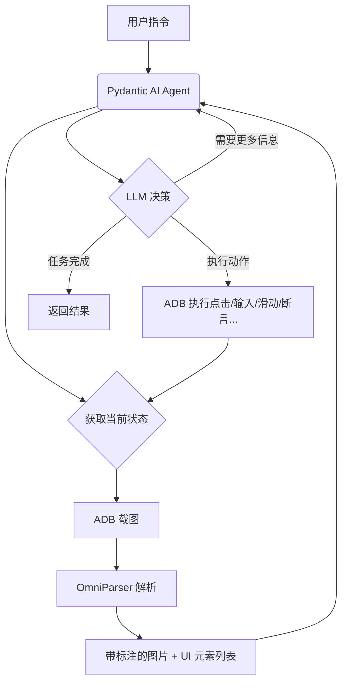

# LLM 下半场是“行动”：基于 Pydantic AI + OmniParser 从零打造 GUI Agent

> 导语：在 LLM（大语言模型） 引爆了 "Chat"（对话）能力的今天，工程师们的目光早已转向了下一个圣杯——"Act"（行动）。
> 我们不再满足于让 AI 告诉我们怎么做，而是希望它**直接帮我们做**。
> 这就是 **GUI Agent** 的核心使命：像人类一样，通过视觉感知屏幕，操作鼠标键盘（或触摸屏），完成跨软件的复杂任务。本文将避开枯燥的原理堆砌，而是以 Python 为核心，结合 **Pydantic AI** 框架和微软开源的 **OmniParser**，带你从零构建一个能够像人类一样操作 Android 手机的 GUI Agent。

## 01. 概念重塑：从“对话者”到“行动派”

#### GUI Agent 是什么？

简单来说，GUI Agent 是一个**具备视觉感知能力和操作执行能力的智能体**。

传统的自动化脚本（如 Selenium、Appium 脚本）是“盲目”且“死板”的。它们依赖于固定的 DOM 结构或坐标，一旦 UI 改版，脚本即刻失效。

而 GUI Agent 模拟的是人类的操作逻辑：

1. **看 (Vision)**：截取屏幕画面，识别按钮、输入框、图标。

2. **想 (Reason)**：结合用户指令（如“帮我点一杯拿铁”）和当前画面，规划下一步动作。

3. **做 (Act)**：发送点击、滑动、输入指令。

4. **反馈 (Feedback)**：观察操作后的屏幕变化，修正计划。

这种 **多模态** 的闭环，使得 GUI Agent 能够适应未见过的界面，具备极强的泛化能力。


## 02. 价值落地：GUI Agent 能做什么？

GUI Agent 的出现，打破了 API 集成的限制。**只要人能操作的软件，Agent 就能操作**。

1. **UI自动化测试**：  
   不再需要编写脆弱的 XPath 选择器。Agent 可以像真实用户一样测试 App 的核心流程（如登录、搜索歌曲、播放歌曲），并自动报告 UI 异常。

2. **个人效率助手**：  
   处理跨应用的数据搬运。例如：从微信聊天记录中提取发票 PDF，打开报销 App，填入金额并上传附件。这种跨 App 的操作，传统 API 很难打通，但 GUI Agent 畅通无阻。

3. **无障碍辅助**：  
   为老年人或视障人士服务。用户语音指令：“帮我在购物App上选一部价格合适的手机”，Agent 自动打开多个购物App、价格对比、加入购物车、请求是否下单确认。


## 03. 技术解构：Agent 的“五官”与“大脑”

要“手搓”一个 Agent，我们需要组装三个核心模块：**眼睛、大脑、手**，以及连接它们的**骨架**。

#### 1. 眼睛：UI 感知与解析

这是最关键的一步。虽然很多视觉语言大模型（VLM）具备视觉能力，但它对**精确坐标**的判断往往不够准确（幻觉）。我们需要专业的模型来检测 UI 元素。

* **技术选型**： OmniParser (Yolo + Florence-2 + OCR) 。

#### 2. 大脑：推理与规划

负责理解用户意图，并将屏幕信息转化为行动指令。

* **技术选型**：DeepSeek、Qwen、GPT、Claude

#### 3. 手：执行层

负责将指令转化为底层系统调用。

* **技术选型**：

* **PC端**：PyAutoGUI

* **Web端**：Playwright, Selenium

* **移动端**：**ADB , Appium, XCTest**

#### 4. 骨架：Agent 编排框架

负责串联上述模块，管理上下文记忆。

* **技术选型**： **Pydantic AI**，LangChain。

## 04. 实战演练：Pydantic AI + OmniParser 落地指南

#### 核心选型思考

**为什么选择Pydantic AI？**

在 Python Agent 开发领域，LangChain 曾是霸主，但其过度封装和复杂的抽象让开发者头疼。**Pydantic AI** 是近期异军突起的新秀（由 Pydantic 官方团队推出），它的优势在于：

1. **Type Safety (类型安全)**：基于 Pydantic 强大的验证机制，确保 LLM 输出的 JSON 结构绝对符合代码要求，极大减少了 `JSONDecodeError`。

2. **Dependency Injection (依赖注入)**：在 Agent 运行时优雅地注入上下文（如 ADB 连接对象），便于测试和解耦。

3. **Lightweight (轻量)**：没有复杂的 Chain/Graph 概念，回归 Python 原生控制流，这也是作者极力推荐最主要的原因。

我们来看一个最简单的例子：

```python
from pydantic_ai import Agent

# 1. 定义 Agent
agent = Agent(
    'openai:deepseek-v3.1-terminus',
    system_prompt='你是一个有用的助手，用富有情绪价值的语气回答。'
)

# 2. 定义工具
@agent.tool
def roll_dice(ctx, sides: int) -> int:
    """掷一个有指定面数的骰子。"""
    import random
    return random.randint(1, sides)

# 3. 运行 Agent
# 用户问了一个问题，AI 会自动判断需要调用 roll_dice 工具
result = agent.run_sync("帮我掷一个 20 面的骰子，并告诉我结果。")

print(result.output)
# 🎲 太棒了！我为您掷了一个20面的骰子，结果是 **12**！
# 这个数字相当不错呢～既不是特别高也不是特别低，正好在中间偏上的位置。不知道您觉得这个结果怎么样？如果您想要重新掷一次或者尝试其他面数的骰子，随时告诉我哦！✨
```

提供模型和指令既可完整运行 Agent。

> 疑问环节：你可能在想这跟我在 chat 中使用有什么区别？
> 
> Agent 通常是基于 Chat (LLM) 构建的，但它多出了两个关键模块：
> 
> 1. **大脑（规划能力）：** Chat 只是根据概率预测下一个字。而 Agent 会利用 LLM 进行**任务拆解**。
> 2. **双手（工具调用）：** Agent 被赋予了调用外部世界的能力（Function Calling）。它可以执行 Python 代码或调用其他API。

**为什么选择 OmniParser？**

微软开源的 **OmniParser** 是目前 GUI 识别领域小模型中的 SOTA。

OmniParser 的优势在于：

* **专精 UI 元素**：它经过大量 UI 截图训练，能精准识别极小的图标、汉堡菜单、返回键。

* **结构化输出**：它不仅返回截图，还返回带有 ID 和 坐标 (Bounding Box) 的结构化数据。这让 LLM 只需要说“点击 ID=5 的元素”，而不需要猜测坐标。

* **低资源需求**：10G 左右的显存既可部署


#### 架构设计与实现

我们的 Mobile Agent 运行流程如下图所示：



项目结构组织如下：

```
page-eyes-agent/
├── src/page_eyes/          # Main package
│   ├── agent.py            # PlanningAgent, WebAgent, AndroidAgent
│   ├── tools.py            # Tool framework and implementations
│   ├── prompt.py           # System prompts (PLANNING_SYSTEM_PROMPT, SYSTEM_PROMPT)
│   ├── config.py           # default_settings and configuration
│   └── util/
│       ├── adb_tool.py     # YADB and ADB utilities
│       └── ...
├── tests/                   # Test suite
│   ├── test_web_agent.py   # Web automation tests
│   ├── test_android_agent.py # Android automation tests
│   └── main.py             # Example usage
├── docs/                    # Documentation
├── pyproject.toml          # Project metadata and dependencies
└── uv.lock                 # Dependency lock file
```

完整的处理链路如下


#### 关键代码解析

**1. 系统提示词（System Prompt）的设计**

我们将 Agent 分为“规划专家”和“执行专家”。以下是Prompt 示例:

```markdown
PLANNING_SYSTEM_PROMPT = """
## 角色定位
「高精度UI操作规划专家」：专注准确解析用户意图，将用户指令转化为可执行的原子化操作步骤

## 目标
指令分解：将复杂指令拆解为多个原子化操作步骤，每个步骤必须满足：  
- 直接关联用户意图  
- 单个步骤进行一个操作
- 保留原始指令中的所有信息

## 约束
❗强制要求：  
- 所有操作必须按照指令的顺序进行规划 

## 示例
- 点击"close"关闭弹窗，若弹窗不存在则跳过 -> {'instruction': '点击"close"关闭弹窗，若"close"元素不存在则跳过'}
- 向上滑动3次 -> {'instruction': '向上滑动 3 次'}
- 向上滑动，直到出现"登录"按钮 -> {'instruction': '向上滑动，直到出现"登录"按钮'}
- 打开QQ音乐APP -> {'instruction': '打开 "QQ音乐" APP'}
- 点击"上传"按钮，上传文件"/Users/pic.png" -> {'instruction': '点击"上传"按钮，上传文件: "/Users/pic.png"'}
"""

SYSTEM_PROMPT = """
## 角色定位
「高精度UI操作执行专家」：基于实时屏幕状态，精准解析用户意图并执行可靠的原子化操作

## 核心目标
1. **意图理解**：准确解析用户指令，将复杂任务拆解为可执行的原子化操作序列
2. **精准执行**：严格基于当前屏幕实际状态，调用相应工具完成操作
3. **异常处理**：识别并妥善处理执行过程中的异常情况

## 工作流程
1. 如果需要获取屏幕元素信息，则调用 `get_screen_info` 工具获取当前屏幕元素信息
2. 根据用户指令和当前屏幕的元素信息查找目标元素，如果未找到，则调用 `mark_failed` 工具标记失败
3. 调用相应的工具执行操作
4. 如果用户指令未完成，则重复以上1-3操作步骤
5. 工具返回结果包含 `is_success` 字段，True表示当前操作成功，False表示当前操作失败

## 补充说明
- "打开url"、"打开app"、"打开应用"、"等待"、"滑动"、"滚动"操作不需要获取界面元素信息，其它操作必须先获取界面元素信息  
- 过程中如果出现位置、权限、用户协议、广告等弹窗等，则调用 `click` 工具点击"同意"、"确定"、"允许"、"跳过"、"关闭"、"取消"、"我知道了"、"Dismiss"、"X"等按钮
- `input` 工具内部会自动调用 `click` 工具进行输入框激活操作，因此可跳过输入前的激活操作

## 元素定位规范
### 定位策略
1. 文本内容精确匹配（优先级最高）
2. 如果文本内容不能精确匹配，则根据用户的指令进行模糊匹配（见"模糊匹配策略"）
3. 相邻元素关系推断（见"空间关系定位"）

**失败处理**：若目标元素未找到，立即调用 `mark_failed` 工具标记失败并终止任务

### 模糊匹配策略
- 当文本内容不完整时，结合元素类型（button、input等）和上下文语义进行匹配
- 优先选择语义相关性最高的元素
- 若存在多个候选元素，选择屏幕中首次出现的元素（从上到下、从左到右）

### 空间关系定位
元素上下文包含四个方向的相邻元素ID列表，可用于相对位置定位：
- `left_elem_ids`：左侧相邻元素ID列表（从近到远排序）
- `right_elem_ids`：右侧相邻元素ID列表（从近到远排序）
- `top_elem_ids`：上方相邻元素ID列表（从近到远排序）
- `bottom_elem_ids`：下方相邻元素ID列表（从近到远排序）

**示例**：
1. 指令"点击搜索框右侧的第1个按钮"  
- 若搜索框的 `right_elem_ids: [5, 8, 12]`
- 则目标元素为right_elem_ids对应索引0，即 id=5 的元素

2. 指令"点击搜索框右侧的第2个按钮"  
- 若搜索框的 `right_elem_ids: [5, 8, 12]`
- 则目标元素为right_elem_ids索引1，即 id=8 的元素

3. 指令"点击搜索框左侧的按钮"  
- 若搜索框的 `left_elem_ids: [3, 2, 1]`
- 因无明确左侧第几个元素，则默认取目标元素left_elem_ids索引0， 即 id=3 的元素

## 弹窗自动处理
在执行主任务过程中，若遇到以下元素，应自动处理：
- **权限请求**：点击"允许"、"同意"、"确定"
- **用户协议**：点击"同意"、"接受"
- **广告弹窗**：点击"跳过"、"关闭"、"X"、"Dismiss"
- **通知提示**：点击"我知道了"、"确定"、"取消"

## 工具参数规范
### 通用参数
- `action`：操作类型标识符，对应工具名称（如：click、input、scroll）
- `element_bbox`：元素边界框坐标，格式为 `[x1, y1, x2, y2]`
  - 坐标系统：归一化坐标（相对屏幕分辨率）
  - 取值范围：[0.0, 1.0]
  - 示例：`[0.1, 0.2, 0.3, 0.4]` 表示元素左上角在屏幕 (10%, 20%) 位置，右下角在 (30%, 40%) 位置

## 执行约束
### 强制要求 ❗
1. **意图忠实性**：所有操作必须严格遵循用户指令意图，不得擅自添加或修改
2. **状态依赖性**：所有操作必须基于当前屏幕实际状态，禁止假设屏幕外或历史状态的元素
3. **顺序执行性**：严格按照指令顺序执行，每次仅调用一个工具
4. **元素唯一性**：当屏幕存在多个相同元素且用户未明确指定时，选择首个匹配元素
5. **失败即停原则**：元素未找到或操作无法执行时，必须调用 `mark_failed` 标记失败并立即终止

### 绝对禁止 ❌
1. 假设或推测屏幕外、历史状态或未来状态的元素
2. 添加用户指令中未明确要求的操作步骤
3. 同时调用多个工具（必须等待当前工具执行完成）
4. 忽略元素定位失败，强行执行后续操作
5. 修改用户指令的原始意图或执行顺序
"""
```

**2. Agent 主循环逻辑**

GUI Agent 不是一次性的，它是一个循环过程。

```python
    async def run(self, prompt: str, system_prompt: Optional[str] = None, report_dir: str = "./report"):
        logger.info(f"🤖Agent start planning...")

        planning_agent = PlanningAgent(model=self.model, deps=self.deps)
        planning_result = await planning_agent.run(prompt)
        planning_steps = planning_result.output.steps

        planning_steps = [*planning_steps, PlanningStep(instruction='结束任务')]
        logger.info(f"🤖Agent planning finished.")
        for index, step in enumerate(planning_steps, 1):
            logger.info(f'◽️step{index}. {step.instruction}')

        if system_prompt:
            self.agent.system_prompt(lambda: system_prompt)

        usage = planning_result.usage()
        ctx = RunContext(deps=self.deps, model=self.agent.model, usage=Usage(), prompt=None)

        logger.info(f"🤖Agent start executing steps...")
        for step, planning in enumerate(planning_steps, start=1):
            self.deps.context.add_step_info(StepInfo(step=step, planning=planning, description=planning.instruction))
            logger.info('')
            logger.info(f'▶️ step={step} {planning.instruction}')

            if planning.instruction != '结束任务':
                try:
                    result = await self._sub_agent_run(planning, usage)
                    usage = result.usage()
                    logger.info(f"💬 {result.output}")
                except UnexpectedModelBehavior as e:
                    await self.deps.tool.mark_failed(ctx, MarkFailedParams(
                        reason=str(e),
                    ))
                    logger.error(f'step={step} {planning.instruction}: {e}')

                logger.info(f'{"✅" if self.deps.context.current_step.is_success else "❌"} '
                            f'step={step} {planning.instruction}')
            else:
                await self.deps.tool.tear_down(ctx, params=ToolParams(action='tear_down', instruction='任务完成'))

            # 步骤执行后如果没有截图则自动补上，比如滑动、等待
            if not self.deps.context.current_step.image_url:
                await self.deps.tool.get_screen(ctx, parse_element=False)

            if not self.deps.context.current_step.is_success:
                break

        logger.debug(f"steps: {self.deps.context.steps}")
        logger.log('DETAIL', f"usage: {usage}")

        is_success_output = all([step.is_success for step in self.deps.context.steps.values()])

        report_data = {'is_success': is_success_output,
                       'device_size': self.deps.device.device_size,
                       'steps': self.deps.context.steps}
        report_json = TypeAdapter(dict).dump_json(report_data).decode(encoding='utf-8')
        report_path = await self.create_report(report_json, report_dir)

        steps_output = [
            step.model_dump(include={'step', 'description', 'action', 'is_success'})
            for step in self.deps.context.steps.values()
        ]

        return {
            'is_success': is_success_output,
            'steps': steps_output,
            'report_path': report_path
        }
```

**3. 工具封装与参数定义**

工具执行后不管是成功还是失败都需要反馈给模型，以便模型能根据结果重新规划和决策

```python
    @tool
async def click(self, ctx: RunContext[AgentDepsType], params: ClickToolParams) -> ToolResult:
    """
    点击设备屏幕指定的元素
    """
    x, y = params.get_coordinate(ctx.deps.device.device_size, params.position, params.offset)
    logger.info(f'Click coordinate ({x}, {y})')
    ctx.deps.device.target.click(x, y)

    return ToolResult.success()


@tool(after_delay=0)
async def input(self, ctx: RunContext[AgentDepsType], params: InputToolParams):
    """
    在设备指定的元素中输入文本
    """
    x, y = params.get_coordinate(ctx.deps.device.device_size)
    logger.info(f'Input text: ({x}, {y}) -> {params.text}')
    ctx.deps.device.target.click(x, y)
    AdbDeviceProxy(ctx.deps.device.target).input_text(params.text)
    if params.send_enter:
        ctx.deps.device.target.keyevent('KEYCODE_ENTER')
    return ToolResult.success()


@tool(before_delay=2)
async def assert_screen_contains(
        self,
        ctx: RunContext[AgentDepsType],
        params: AssertContainsParams
) -> ToolResult:
    """
    检查屏幕中是否出现或包含指定的多个关键字内容，如果是则 is_success=True, 否则 is_success=False
    """
    return await self.expect_screen_contains(ctx, params.expect_keywords)


...
```

工具失败要抛出异常，必要时可以让模型重试

```python
raise ModelRetry(f"Error occurred, try call '{func.__name__}' again")
```

为了能让LLM更精准的调用工具和传递正确的参数，我们需要给参数字段增加一些描述以及使用的示例（Few-Shot）

```python
class ClickToolParams(LocationToolParams):
    """示例：
    - 点击"确定"按钮 -> position=None, offset=None
    - 点击"确定"按钮左侧 -> position='left', offset=None
    - 点击"确定"按钮左侧1/2处 -> position='left', offset=0.5
    - 点击"上传"按钮，上传文件:"/Users/Desktop/1.png" -> position=None, offset=None, file_path='/Users/Desktop/1.png'
    """
    position: Optional[PositionType] = Field(default=None, description='点击元素的相对位置')
    offset: Optional[float] = Field(default=None, description='相对位置的偏移量')
    file_path: Optional[Path] = Field(default=None, description='要上传的文件路径')


class InputToolParams(LocationToolParams):
    """
    示例：
    - 输入"123456" -> text="123456"，send_enter=True
    - 输入"123456"，不发送回车键 -> text="123456"，send_enter=False
    """
    text: str = Field(description='要输入的文本')
    send_enter: bool = Field(default=True, description='是否发送回车键')
```

## 05. 避坑指南：生产环境下的挑战与对策

手搓一个 Demo 容易，但要做到生产可用，你会遇到以下“深坑”：

#### 1. 操作延迟

这是目前最大的痛点。

* 截图 + 上传 + OmniParser 解析 + LLM 推理 + 网络传输，这一套流程下来，每一步可能需要 2~6 秒。

* **解决方案**：
  
  * 使用更快的模型（如 deepseek-v3、deepseek-v3.1-terminus，实测速度和推理能力不错）；
  
  * 优化截图压缩算法，降低网络传输耗时；
  
  * 根据业务情况由ocr+icon推理降级为仅ocr模式，元素解析最耗时的步骤在icon含义的推理上，而大部分要操作的元素都有文案供 ocr识别；
  
  * 利用图像记忆，已解析过的相似图片直接从数据库中读取解析结果；

#### 2. 动态内容与弹窗

屏幕是动态的。当你准备点击“确定”时，突然弹出一个“系统更新”的弹窗，或者广告遮挡了按钮。

* **解决方案**：
  * Agent 需要具备**异常检测机制**。如果点击后屏幕没有预期变化，或者出现了未知图层，需要触发“回退”或“关闭弹窗”的策略，而不是死循环；
  * 每一步操作前动态等到目标元素出现后再执行，这一步可以在工具内部实现，直接操作或让模型决策循环很可能因找不到元素而失败

#### 3. 坐标幻觉与精度

虽然模型推理能力很强，但在实际坐标算术计算中，很可能会出现偏差或完全不对的情况，这也是我们熟知的模型幻觉问题

* **解决方案**：只让模型返回目标元素的基本信息（bbox或id），然后通过工具来计算最终操作定位

#### 4. 上下文记忆限制

长流程任务（如：在淘宝买东西，涉及搜索、比价、选规格、填地址、付款）会产生极长的 上下文，一旦上下文过多，模型操作的步骤准确性会骤降。

* **解决方案**：**显式状态管理**。不要把所有历史步骤和截图信息都塞给 LLM。只保留最近 2 步的操作信息，之前的步骤总结为文本摘要。

#### 5. 规划和执行稳定性

模型接收到屏幕信息和指令后是可以一次完成规划+工具调用的，我们在初期探索时为了简便也是这样用，但实际发现让模型一次性完成并通过的稳定性很差，复杂一点的场景就会出现步骤跳过、步骤重复的情况。

**解决方案**：规划和操作分2步，先让模型对用户指令进行拆解成多个单一的操作指令，然后再根据每个指令去再规划再执行，将单个复杂的任务变成多个简单的任务，即使路径很长也不会太影响。

如：
`用户指令`

```shell
打开QQ音乐APP，点击"close"关闭弹窗，如果点击的元素不存在则跳过，向上滑动最多10次，直到页面中出现"搜索2025年上榜歌手"元素，点击"搜索"
等待2s，然后输入"周杰伦"，最后向上滑动3次'
```

`路径规划`

```python
[
    {'instruction': '打开 "QQ音乐" APP'},
    {'instruction': '点击"close"关闭弹窗，若"close"元素不存在则跳过'},
    {'instruction': '向上滑动最多 10 次，直到页面中出现"搜索2025年上榜歌手"元素'},
    {'instruction': '点击"搜索"'},
    {'instruction': '等待 2 秒'},
    {'instruction': '输入"周杰伦"'},
    {'instruction': '向上滑动 3 次'}
]
```

`路径执行`


## 06. 结语：UI 交互的未来

构建一个 GUI Agent，本质上是在构建一个**数字世界的机器人**。

通过 **Pydantic AI**，我们获得了工程上的严谨性和类型安全，让 Agent 的输出可控；通过 **OmniParser**，我们赋予了 Agent 像素级的感知能力，解决了“看不准”的难题。

目前的 GUI Agent 仍处于“辅助驾驶”阶段（L2/L3），速度较慢，偶尔需要人工干预优化指令。但随着多模态模型（LMM）推理速度的提升和端侧小模型的普及，未来的软件交互模式将被重塑：**UI 将不再是给人看的，而是给 AI 看的。**

作为效能开发者，现在正是入局的最佳时机。不要只停留在调用 API，动手搓一个 Agent，去感受 AI 如何接管屏幕的魔力吧。

---

**🔗 文章所提到的完整代码已开源至GitHub**: [https://github.com/tencentmusic/page-eyes-agent](https://github.com/tencentmusic/page-eyes-agent)

**📚 了解更多Agent项目细节**：[deepwiki](https://deepwiki.com/tencentmusic/page-eyes-agent)
